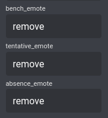

# Raid-Helper JSON Sorter

### Pre-setup:
Disable the Bench, Tentative and Absent buttons from your raid sheet: 

### Instructions to use:
1. Click the 'Web View' button at the bottom of the signup sheet on Discord
2. Right-click the 'JSON' button at the top right of the page and 'Save link as...'
3. Save the file under the name 'data.json', make sure it's in the same spot as 'RaidJsonSorter.py'
4. Run 'RaidJsonSorter.py' in your terminal or however you like to run python files (python RaidJsonSorter.py)

NOTE: If you have run this python program before, make sure to delete the 'output.csv' first!

5. It is done, there is now an 'output.csv' file you can import into your spreadsheet of choice
